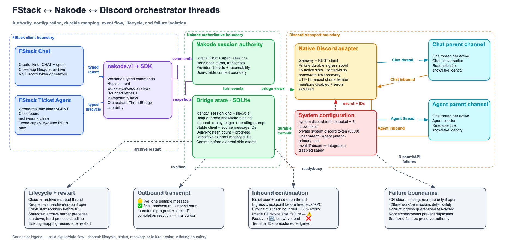
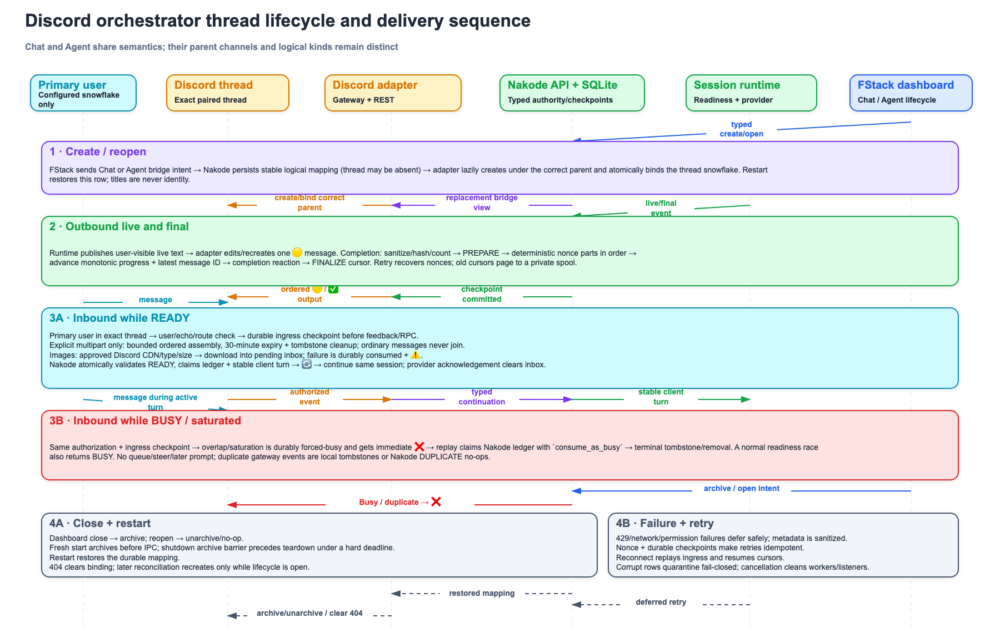

# Discord orchestrator threads

Nakode can optionally project FStack Chat conversations and Ticket Agent sessions into Discord threads. Nakode remains the authority for logical sessions, readiness, turns, transcript state, thread identity, inbound deduplication, and delivery checkpoints. FStack only declares typed bridge intent and open/archive lifecycle through `nakode.v1`; it never receives the Discord credential or calls Discord.

This integration has deterministic fake/contract coverage but has **not** yet been validated against a credentialed live Discord bot.

## Discord application setup

Create a bot application in the Discord developer portal and enable:

- **Guild Messages** gateway intent;
- the privileged **Message Content** gateway intent.

Install the bot into the server containing the two parent channels. Grant the bot, in both parent channels:

- View Channel;
- Read Message History;
- Send Messages;
- Send Messages in Threads;
- Create Public Threads;
- Manage Threads (required to archive and unarchive a mapped thread);
- Add Reactions.

Use two different text-channel snowflakes: one parent for Chat Orchestrator threads and one for Agent Orchestrator threads. Copy the immutable snowflake for the one Discord user allowed to continue sessions. Names and thread titles are display-only and are never identities.

## Configure Nakode

Run setup once for the Nakode installation, using any canonical workspace served by the installation:

```sh
nakode --workspace /path/to/workspace transport discord setup \
  --chat-channel-id 123456789012345678 \
  --agent-channel-id 234567890123456789 \
  --primary-user-id 345678901234567890
```

`setup` prompts for the bot token without echoing it. Omitting any ID flag prompts for that snowflake. The v2 public configuration contains only:

```toml
version = 2
enabled = true
chat_channel_id = "123456789012345678"
agent_channel_id = "234567890123456789"
primary_user_id = "345678901234567890"
```

The bot token is stored separately as `discord.token` in the private Nakode application-data root (mode `0600` on Unix). The public configuration and token are installation-level and shared by canonical workspaces; each workspace keeps its ingress/recovery state in a separate hashed subdirectory so authorities cannot consume one another's work. The token is absent from TOML, SQLite, protobuf views, status output, logs, transcript payloads, FStack state, and debug formatting. `NAKODE_DISCORD_DIR` may override the private storage root for an installation. Protect that directory as a credential store; never commit or screenshot it.

Inspect and operate the transport with:

```sh
nakode --workspace /path/to/workspace transport discord status
nakode --workspace /path/to/workspace transport discord status --json
nakode --workspace /path/to/workspace transport discord start
nakode --workspace /path/to/workspace transport discord stop
nakode --workspace /path/to/workspace transport discord restart
nakode --workspace /path/to/workspace transport discord enable
nakode --workspace /path/to/workspace transport discord disable
```

`enable` persists automatic startup and starts the live transport for the selected workspace when its service is available. Because configuration is system-level, restart any other already-running Nakode workspace services after changing it; newly started services read it automatically. `start` is a live action and does not change the persisted enabled flag. `disable` makes the integration optional again and stops the selected workspace transport without affecting dashboard or Nakode session behavior. Missing configuration, a missing token, invalid snowflakes, missing permissions, or a Discord outage cannot disable normal FStack/Nakode use.

Configuration v1 is intentionally not migrated. Rerun `setup`; historical bindings are not reconstructed.

## Session and thread lifecycle

FStack sets a typed `SessionBridgeIntent` while creating either a Chat or Agent logical session. Nakode persists one `session_bridges` row keyed by logical session ID. The row records workspace, orchestrator kind, desired lifecycle, display title/revision, transport and parent/thread snowflakes, constant-size final-delivery progress, live-message identity, source-message identity, and any accepted pending inbound prompt. The authoritative, never-expiring replay identities live in normalized `session_bridge_inbound_events` rows; a private 256-entry in-memory cache is only a fast path. Private inbound/deduplication state and prompt contents are not returned in public projections.

A bridge is optimistic: it can be open without a Discord thread. Nakode creates a thread only when reconciliation has useful work, then claims the returned thread snowflake through a typed mutation. A deterministic starter nonce recovers a thread after uncertain sends. The SQLite unique index on `(transport, external_thread_id)` prevents cross-wiring, and a concurrent loser adopts the authoritative binding and archives its orphan best-effort. Titles are readable but never used to recover identity.

- Closing a Chat or Agent sets the bridge to `archived`; the bot archives the mapped thread.
- Reopening sets it to `open`; an already-open thread is a successful no-op.
- A deleted/missing Discord thread clears only the external binding. A later useful reconciliation may create a replacement for the same logical session.
- On a fresh FStack process start, all known workspace bridges are archived before create/resume IPC is exposed. On process shutdown, Chat and every known Agent workspace enter an archive barrier before any Chat/Agent teardown begins. The whole process still has a hard shutdown deadline; an unavailable endpoint may therefore cause the process to quit without starting teardown, but teardown is never allowed to overtake an in-flight archive sweep. Individual failures are logged without credentials and cannot block/corrupt Nakode state.
- Reopening after restart reuses the durable thread snowflake when Discord still has it.

## Outbound delivery and idempotency

Only user-visible assistant transcript entries are projected. Provider internals, tool protocol payloads, hidden instructions, and intentional redactions are not sent. Discord mentions are text-neutralized and `allowed_mentions` disables user, role, everyone, and reply pings.

Live assistant text is represented by one editable message and the yellow-circle reaction. It is not a completed turn. A completed answer is UTF-16-aware chunked at 1,900 units, with ordered continuation chunks and fenced-code close/reopen handling; content is not intentionally truncated. Before any send, Nakode durably records:

1. the final turn ID, body SHA-256, and total part count;
2. a monotonic `completed_parts` count and only the latest accepted Discord message snowflake;
3. final cursor advancement only after every part and the completion reaction are recorded.

Part nonces are derived deterministically from session, turn, and index rather than retained in an ever-growing protocol record. Retrying the latest completed part must present the same external message snowflake; a conflicting identity fails closed. Clearing a deleted thread binding resets pending delivery progress so a replacement thread receives the answer from part zero.

Retries search for deterministic nonces before sending, edit recovered messages, and therefore survive send-before-checkpoint crashes. Removing an already-absent live reaction is an idempotent no-op; the completed reaction must succeed before finalization. Nonce history lookup is capped at 64 pages/6,400 messages and fails closed rather than risk a duplicate. Serenity applies Discord rate-limit handling; bridge workers reconnect with jittered backoff and retry deferred projection. A persisted delivery cursor prevents restored transcript history from being replayed. If that cursor is older than the normal 1,024-entry replacement snapshot, the adapter pages backward through the typed transcript API into a private disk spool while retaining only bounded data in memory, locates the cursor, and then hydrates/delivers one final answer at a time in chronological order. If the authoritative cursor cannot be found, delivery fails closed instead of replaying history.

## Discord to Nakode

Inbound control is accepted only when all of these are true:

- the author snowflake exactly equals `primary_user_id`;
- the event is not from a bot or webhook;
- the channel is the exact currently bound thread;
- the bridge is open and bound to `discord`;
- Nakode says the logical session is idle/ready.

Unauthorized users, echoes, wrong channels, unknown/deleted mappings, and archived sessions are ignored without mutating session state. Every authorized paired gateway message is first checkpointed in a private `discord-ingress.sqlite` spool (mode `0600` on Unix) before reactions or Nakode RPCs. Executable rows store text, immutable identities, attachment descriptors, and multipart grouping—not downloaded attachment bytes. Rows durably classified as overload/busy retain only identity and route metadata, never prompt text or attachment URLs. Admission uses an immediate SQLite transaction, so independent Nakode processes cannot both classify same-session events as executable. A single restartable replayer and 16 normal-work slots bound active processing; same-session later ordinary messages are durably marked forced-busy so they cannot overtake an unresolved turn. Terminal local identities become compact tombstones, and malformed payloads are fail-closed quarantined without retaining their content, so a reconnect/reopen cannot resurrect them and one corrupt row cannot block other sessions.

A busy message is durably consumed as `Busy`; it is never queued and can never become a later prompt. Accepted and busy gateway event IDs are persisted in Nakode's normalized ledger so duplicate gateway delivery and restart replay are harmless. The SDK derives the continuation mutation key from the session, transport, thread, and external-event identities, so a caller retrying the same request in a later SDK invocation uses the same server idempotency identity; an explicitly supplied mutation key is always preserved. Accepted prompts use a stable `bridge-<sha256-prefix>` provider client-turn identity and remain in a durable pending inbox until Nakode observes `TurnAccepted`, `TurnStarted`, or `TurnCompleted`. A bridge checkpoint is persisted before provider dispatch; a persistence error rolls logical and idempotency state back so the same-key retry can execute safely. Crash recovery redispatches the same client identity, providing at-least-once transport semantics. Native adapters and compatibility protocols that expose a client-message ID preserve that identity; a provider protocol that does not honor client idempotency inherently retains an ambiguous crash-after-dispatch window and cannot offer distributed exactly-once execution.

Discord's own per-message limit is handled for long inbound turns with an explicit grouping rule. Send each part as:

```text
!nakode multipart <group> <part>/<total>
<body for this part>
```

`group` is 1-32 ASCII letters, digits, `_`, or `-`. Parts may arrive out of order, but all parts must use the same total in the same paired thread. A group is complete only when every numbered part exists. One group per logical session and up to 32 groups per workspace may be active, so an incomplete turn cannot overlap a second turn or let one session exhaust every assembly slot; each incomplete part expires 30 minutes after its Discord receipt, and replay does not extend that TTL. Ordinary messages are never heuristically joined, so two separate messages cannot accidentally become one turn. Duplicate part message IDs are ignored. Multipart storage is deliberately proportional to the explicit uncapped prompt during that bounded assembly window; only the configured primary user can create it.

Image inputs must be Discord-hosted HTTPS attachments from `cdn.discordapp.com` or `media.discordapp.net`; redirects are limited to five and must remain on those hosts. Images are limited to 20 MiB each and 30 MiB combined. The accepted, resolved image bytes are part of Nakode's private pending inbox until provider acknowledgement, which makes accepted-turn restart replay independent of expiring CDN URLs. Before acceptance, an expired or failed attachment download is durably consumed as a failed message, receives ⚠️ plus a generic resend instruction, and never becomes a later prompt.

## Reaction vocabulary

| Reaction | Meaning |
|---|---|
| 🔄 | Accepted continuation / provider work is being started |
| 🟡 | User-visible live assistant activity; not a turn end |
| ✅ | Turn-ending answer completed and durably delivered |
| ⚠️ | Turn failed or was cancelled/interrupted |
| ❌ | Ignored as busy; wait for the active turn to finish |

Repeated event handling is idempotent. The bot removes/replaces only its own relevant reaction where practical.

## Failure behavior and observability

Gateway and SDK watches reconnect with jittered backoff, cancellation-aware waits, bounded active work, and task cleanup. Each enabled canonical workspace service owns one gateway client but accepts events only for its exact authoritative thread mappings; installations that run many workspace services concurrently must account for the bot application's Discord gateway session-start limits. Inbound work uses 16 normal slots. Saturation and same-session overlap are persisted as `forced_busy` in the ingress spool before the immediate ❌ feedback; replay then calls the typed continuation boundary with `consume_as_busy`, and only a durable terminal disposition removes the row. Thus a reaction or process crash cannot turn overloaded input into later work. Pending rows remain on RPC timeout/network failure and retry the same identity. Archive/unarchive is tried three times. Missing threads clear mappings; permission/network/rate-limit failures are deferred and logged with shortened logical identities and sanitized SDK/Discord errors. Token material is never included.

Executable ingress payloads and downloaded pending image bytes are removed after their durable terminal/acknowledged disposition. The normalized replay ledger and compact local tombstones retain only event identity and timestamps and intentionally do not expire: pruning them would allow an old busy or accepted gateway event to become a new prompt. Operators should therefore include the private workspace transport directory in ordinary disk monitoring. Worker/task concurrency is bounded; explicit multipart prompt content is intentionally not silently capped, so its temporary disk and assembly-memory cost remains proportional to the primary user's turn during the 30-minute admission window.

Use `transport discord status` and Nakode logs for configuration/runtime state. Status exposes only whether a token is configured, never its value. Because no bot credential is available in the development environment, current assurance consists of deterministic adapters, SQLite/protocol tests, and compile/lint/build gates. Do not interpret that as live Discord validation.

## Architecture artifacts

The PNG previews below are embedded for dashboard/GitHub viewing. Select either preview to open the editable Excalidraw source.

### Architecture and authority boundaries

[](architecture/discord-orchestrator-architecture.excalidraw)

- [Editable Excalidraw source](architecture/discord-orchestrator-architecture.excalidraw)
- [Rendered PNG](architecture/discord-orchestrator-architecture.png)
- [Rendered SVG](architecture/discord-orchestrator-architecture.svg)

### Lifecycle and delivery sequence

[](architecture/discord-orchestrator-sequence.excalidraw)

- [Editable Excalidraw source](architecture/discord-orchestrator-sequence.excalidraw)
- [Rendered PNG](architecture/discord-orchestrator-sequence.png)
- [Rendered SVG](architecture/discord-orchestrator-sequence.svg)
